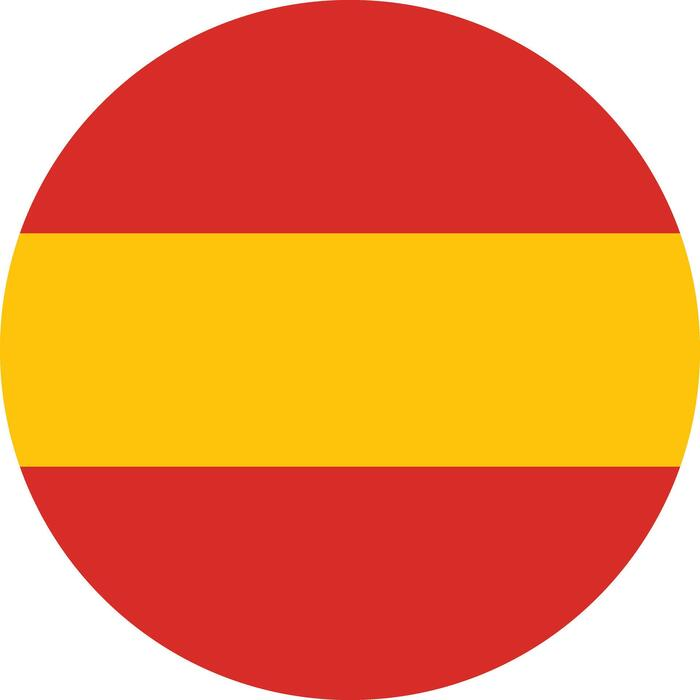

## Hey! What's up? 

###

Welcome to my Github!
I'm Jorge, **Robotics Engineer and Software** Developer from  **Spain**, currently working as a **Researcher at UGR (University of Granada)**.

### Things I use in my day-to-day

       

### What I'm currently working on

* **Visual-Inertial Fusion Research:** Working on an industry-partnered R&D project (OTRI) at the University of Granada, focusing on state estimation and precise localization.
* **[VIO Playground](https://github.com/JorgeSLT/vio-playground):** Building a Visual-Inertial Odometry pipeline from absolute scratch in modern C++ to deeply understand the math behind standard SLAM frameworks.

### Let's Connect

 
